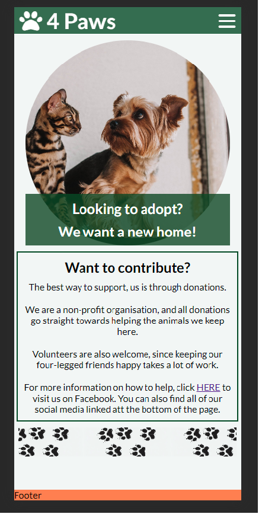

# 4 Paws  

4 Paws is a non-profit organisation, with the goal that all cats and dogs, should be able to find their forever home.

The website is primarily aimed at private individuals, who are looking to adopt a cat or dog.

Since 4 Paws is a non-profit organisation, donations and volunteers are highly important.

The website is also useful for both dog and cat owners, who need help relocating their pet.

## INSERT "Am I responsive" scrrenshots here

## Table of contents

- [4 Paws](#4-paws)
  - [INSERT "Am I responsive" scrrenshots here](#insert-am-i-responsive-scrrenshots-here)
  - [Table of contents](#table-of-contents)
  - [User goals and stories](#user-goals-and-stories)
    - [Goals of the website business owner](#goals-of-the-website-business-owner)
    - [Goals of the user](#goals-of-the-user)
    - [User stories](#user-stories)
      - [Business owner](#business-owner)
      - [General user](#general-user)
      - [New user](#new-user)
  - [Design](#design)
    - [Wireframes](#wireframes)
    - [Fonts](#fonts)
    - [Colors](#colors)
    - [Images](#images)
    - [Text](#text)
  - [Features](#features)
    - [Existing features](#existing-features)
      - [Hero image](#hero-image)
      - [Navigation bar](#navigation-bar)
      - [Footprints image](#footprints-image)
      - [Links on the page](#links-on-the-page)
      - [Footer](#footer)
    - [Features to add inte the future](#features-to-add-inte-the-future)
  - [Languages](#languages)
  - [Technologies Used](#technologies-used)
  - [Testing](#testing)
    - [Validation](#validation)
    - [Responsiveness](#responsiveness)
    - [Manual testing](#manual-testing)
  - [Deplyment](#deplyment)
  - [Bugs](#bugs)
  - [Unfixed bugs](#unfixed-bugs)
  - [Credits](#credits)

## User goals and stories

### Goals of the website business owner

- The goals of the owner is to find new homes for cats and dogs in need.

- To attract donations and volunteers.

- To help if someone is unable to keep their pet.

### Goals of the user

- The user wants to easily view animals available for adoption.

- Easy navigation between pages is important.

- Being able to view the contents of the website on different devices.

- The form for adopting a pet must be easy to understand and fill out.

### User stories

#### Business owner

As the owner of 4 Paws, I want to reach more people to increase chance of adoption.

I want a way to show poeople how they can help, and get in touch with us.

#### General user

As a general user I expect to find links to social media for news and updates.

I also want easy navigation to the "cats & dogs" page, to view potential pets to adopt.

#### New user

As a new user, I expect it to be easy to read some information about 4 Paws.

I also expect easy navigation on the website.

## Design

### Wireframes

Here you will find the link to my wireframes from the design phase.

[Wireframes](https://github.com/hogbergmarkus/4-paws/tree/main/assets/wireframes)

### Fonts

The fonts chosen were "Lato" and a backup sans-serif.

Lato was chosen because it is easy to read, and it has a friendly look.

sans-serif is a great backup because of its wide support across devices and browsers.

### Colors

Background color chosen for the body is an off white (#f2f6f5). It was chosen because it feels nicer to the eyes than a perfectly white background.

A dark green rgba(2, 73, 37, 0.8), was chosen for the header, footer, borders and some elements. It gives some needed contrast, and it also goes along well with almost any color next to itself.

### Images

### Text

All text was written by myself.

## Features

### Existing features

#### Hero image

- The first thing your eyes will be drawn to is the circular hero image, with a banner asking if you want to adopt a pet.

#### Navigation bar

- Navigation bar in the top right of the screen that is accessible from all pages.
- On mobile, the navigation bar is a hamburger icon, to save screen realestate.
- On larger devices the navigation is always visible for easier navigation.
- The page that you are currently on, will be underlined to avoid confusion.
- The organisation logo is also clickable, and will take the user back to the home page.
- When you need to scroll on the page, the navigation bar will allways stay at the top of the screen, for easy navigation.

#### Footprints image

- On the main page is an image of a dogs footprints across the screen, this should provide some enjoyment and a visual break from all the text.

#### Links on the page

- There is a link to Facebook, in the contribute section on the main page, with aria-label, that will open in a new tab.

#### Footer

- The footer contains links to social media, all with aria-labels, and opens in a new tab.

### Features to add inte the future

## Languages

## Technologies Used

## Testing

### Validation

### Responsiveness

### Manual testing

## Deplyment

## Bugs

I have not been able to get rid of this bug. The green banner on the hero image should have rounded corners.

However the div that the banner is placed inside, stretches in a way that makes rounded corners not work.

If time allows it, I will work more on this bug.

## Unfixed bugs

## Credits

README.md structure was heavily influnced by siobhanlgorman, and the specific project Sourdough-Bakes
<https://github.com/siobhanlgorman/Sourdough-Bakes/blob/master/README.md>

Navigation element was created with the help of the Love Running running walkthrough project. I also took inspiration for the footer from Love running.

Thank you to, David Calikes at Code Institute, for great moral support and encouragement.

Icons used were taken from <https://fontawesome.com/>

Favicon was created using <https://favicon.io/>

This image compressor tool was used <https://shortpixel.com/online-image-compression>

Images taken from :

Hero image:
Picture by Helena Jankovičová Kováčová: <https://www.pexels.com/sv-se/foto/hund-sitter-djur-husdjur-16395150/>

Footprints image:
I created the footprints image using Bing chat AI.
