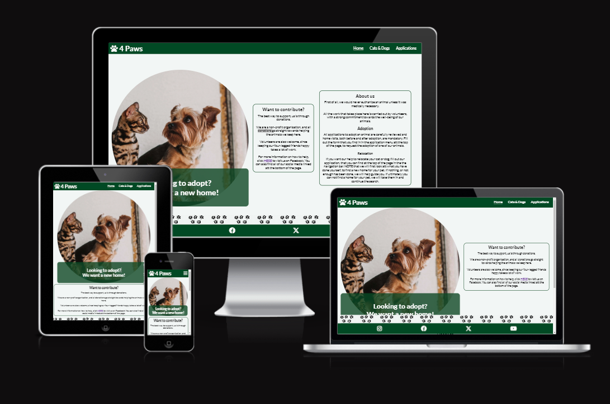
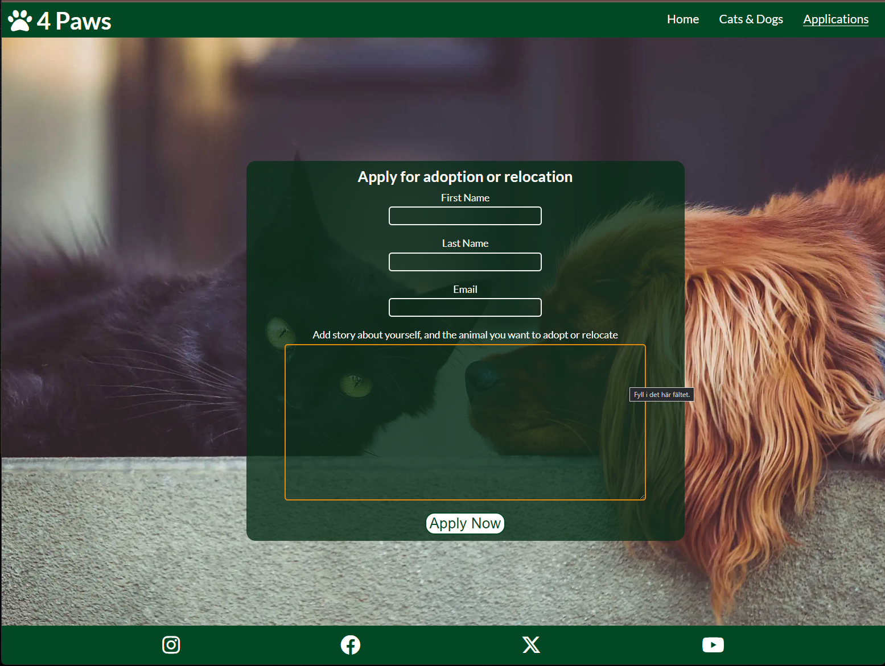
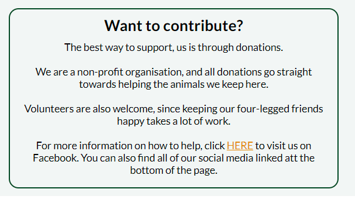
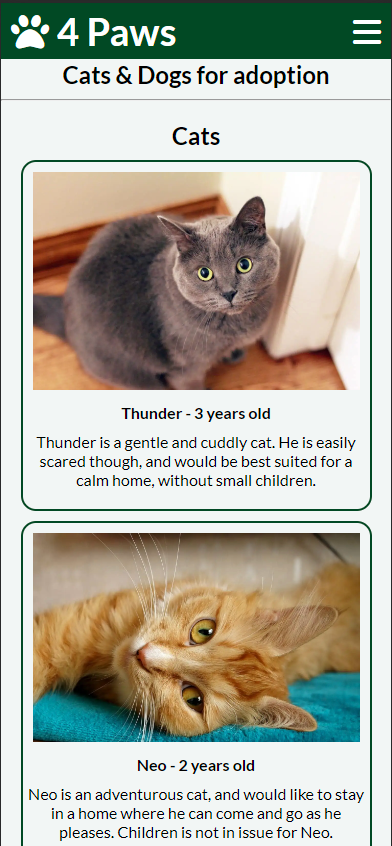
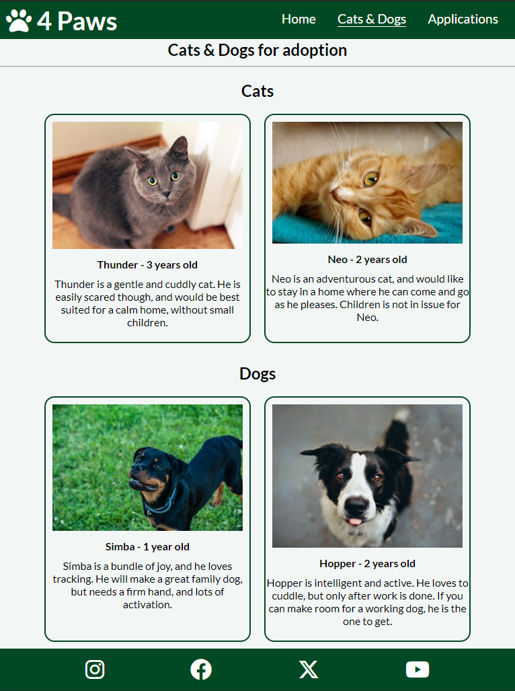
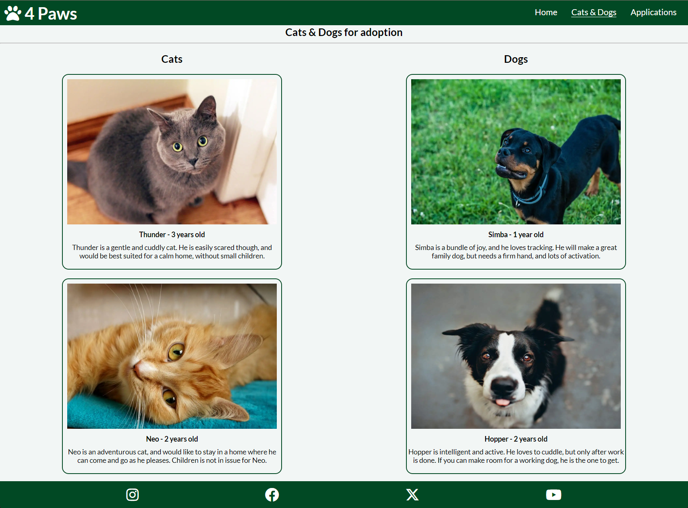
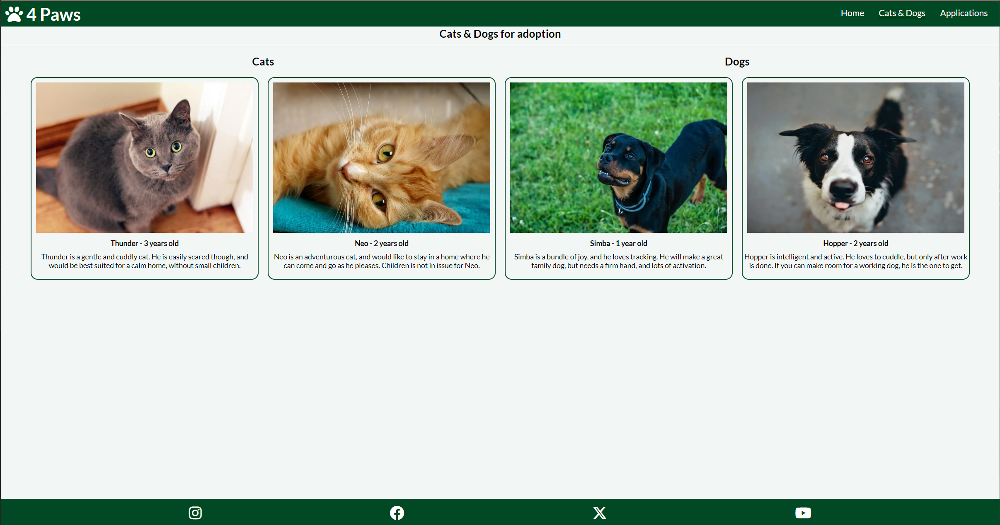
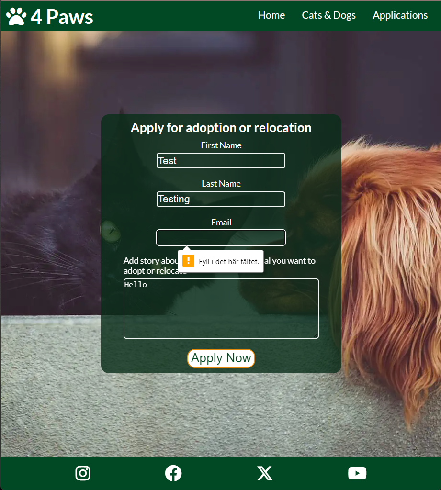
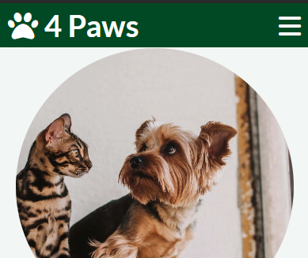
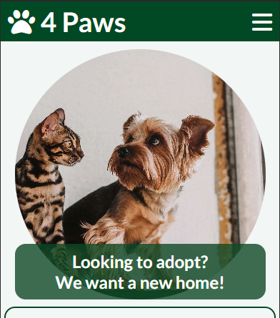

# 4 Paws

## Introduction

[4 Paws](https://hogbergmarkus.github.io/4-paws/) "https://hogbergmarkus.github.io/4-paws/" is a fictional website, aiming to mimic a non-profit organisation, with the goal that all cats and dogs should be able to find their forever home.

The website is primarily aimed at private individuals, who are looking to adopt a cat or dog.

Since 4 Paws is a non-profit organisation, donations and volunteers are highly important.

The website is also useful for both dog and cat owners, who need help relocating their pet.

## Table of contents

- [4 Paws](#4-paws)
  - [Introduction](#introduction)
  - [Table of contents](#table-of-contents)
  - [User goals and stories](#user-goals-and-stories)
    - [Goals of the website business owner](#goals-of-the-website-business-owner)
    - [Goals of the user](#goals-of-the-user)
    - [User stories](#user-stories)
      - [Business owner](#business-owner)
      - [General user](#general-user)
      - [New user](#new-user)
  - [Design](#design)
    - [Wireframes](#wireframes)
    - [Fonts](#fonts)
    - [Colors](#colors)
    - [Images](#images)
    - [Text](#text)
  - [Features](#features)
    - [Existing features](#existing-features)
      - [Hero image](#hero-image)
      - [Navigation bar](#navigation-bar)
      - [Footprints image](#footprints-image)
      - [Responsive links and form elements on larger screens](#responsive-links-and-form-elements-on-larger-screens)
      - [Links on the page](#links-on-the-page)
      - [Cats \& Dogs page](#cats--dogs-page)
      - [Applications page](#applications-page)
      - [Footer](#footer)
    - [Features to add inte the future](#features-to-add-inte-the-future)
  - [Languages](#languages)
  - [Technologies Used](#technologies-used)
  - [Testing](#testing)
    - [Validation](#validation)
    - [Responsiveness](#responsiveness)
    - [Manual testing](#manual-testing)
      - [Links in navigation bar](#links-in-navigation-bar)
      - [Links on Home page](#links-on-home-page)
      - [Links in Footer](#links-in-footer)
      - [Responsiveness on Home page](#responsiveness-on-home-page)
      - [Links in header and footer on Cats \& Dogs page](#links-in-header-and-footer-on-cats--dogs-page)
      - [Responsiveness on Cats \& Dogs page](#responsiveness-on-cats--dogs-page)
      - [Links in header and footer on Applications page](#links-in-header-and-footer-on-applications-page)
      - [Responsiveness on Applications page](#responsiveness-on-applications-page)
      - [Form element on Applications page](#form-element-on-applications-page)
  - [Deployment](#deployment)
  - [Bugs](#bugs)
    - [Unfixed bugs](#unfixed-bugs)
    - [Fixed bugs](#fixed-bugs)
  - [Credits](#credits)

## User goals and stories

### Goals of the website business owner

- The goals of the owner is to find new homes for cats and dogs in need.

- To attract donations and volunteers.

- To help if someone is unable to keep their pet.

### Goals of the user

- The user wants to easily view animals available for adoption.

- Easy navigation between pages is important.

- Being able to view the contents of the website on different devices.

- The form for adopting a pet must be easy to understand and fill out.

### User stories

#### Business owner

As the owner of 4 Paws, I want to reach more people to increase chance of adoption.

I want a way to show poeople how they can help, and get in touch with us.

#### General user

As a general user I expect to find links to social media for news and updates.

I also want easy navigation to the "cats & dogs" page, to view potential pets to adopt.

#### New user

As a new user, I expect it to be easy to read some information about 4 Paws.

I also expect easy navigation on the website.

## Design

### Wireframes

Here you will find the link to my wireframes from the design phase.

[Wireframes](https://github.com/hogbergmarkus/4-paws/tree/main/documentation/wireframes)

### Fonts

The fonts chosen were "Lato" and a backup sans-serif.

Lato was chosen because it is easy to read, and it has a friendly look.

sans-serif is a great backup because of its wide support across devices and browsers.

### Colors

Background color chosen for the body is an off white (#f2f6f5). It was chosen because it feels nicer to the eyes than a perfectly white background.

A dark green rgb(2, 73, 37), was chosen for the header and footer. It gives some needed contrast, and it also goes along well with almost any color next to itself.

The hero banner is set to rgba(2, 73, 37, 0.8), same as the header and footer, but with some opacity for visual effect, wich makes it pleasing to look at.

Borders are also green, rgb(2, 73, 37). They give a good sense of where the different sections are on the main page.

On dark green backgrounds the text is white, and on white backgrounds the text is black, this to keep a good contrast between text and background.

Hover effects are orange, shown with the color rgb(229, 139, 12). It contrasts nicely with the pages generally green tones, and is visually pleasing.

The form on the applications page has a darker green tone to make the background less distracting.

### Images

Images, except the footprints image, were downloaded from [Pexels.com](https://www.pexels.com/) and [pixabay.com](https://pixabay.com/), all images credited in the credits section.

The footprints image was created by me using the Bing chat AI [Bing.com](https://www.bing.com/).

They were optimized using the compressor tool on [Shortpixel.com](https://shortpixel.com/online-image-compression).

### Text

All text was written by myself.

## Features

### Existing features

#### Hero image

- The first thing your eyes will be drawn to is the circular hero image, with a banner asking if you want to adopt a pet.
- This is both visually appealing and directs the user towards the main objective the website, adoption of pets.
- The text banner for the image is also clickable, with a visual hover, and will take the user straight to the cats & dogs page.

#### Navigation bar

- Navigation bar in the top right of the screen that is accessible from all pages.
- On mobile, the navigation bar is a hamburger icon, to save screen realestate.
- On larger devices the navigation is always visible for easier navigation.
- The page that you are currently on, will be underlined to avoid confusion.
- The organisation logo is also clickable, and will take the user back to the home page.
- When you need to scroll on the page, the navigation bar will allways stay at the top of the screen, for easy navigation.
- As a whole this should make navigation on the website easy for users.

#### Footprints image

- On the main page, on small screens, is an image of a dogs footprints across the screen, this should provide some enjoyment and a visual break from all the text.
- On larger screens, the image is placed above the footer instead, this is because it looked out of place in the middle of the screen.

#### Responsive links and form elements on larger screens

- A hover effect is added to link and input elements on larger screens, where you will use a mouse for navigation.
- This helps users visually to understand that they are hovering something they can interact with.

#### Links on the page

- There is a link to Facebook, in the contribute section on the main page, with aria-label, that will open in a new tab.
- This will be of service to users that come across information in the text, and want to go straight to Facebook without extra steps.

#### Cats & Dogs page

- This is the page where users can view what animals are available for adoption.
- It is important that the user gets a good experience on this page, no matter device, since we want them to stay, and the page is highly responsive as it should.

#### Applications page

- This page contains an applications form, which is important to the users that want to adopt a pet, or get help to relocate their own pet.

- Elements have a hover effect on larger screens, to help users visually.

- The form will prompt the user if they missed a field, or did not fill it correctly.

- If all fields are filled correctly, you will get an answer in return with information entered, example shown in this picture:

#### Footer

- The footer contains links to social media, all with aria-labels, and opens in a new tab.

- This is useful to users who want to follow 4-paws actively, and see updates on activities.

### Features to add inte the future

- In the Cats & Dogs section, each animals picture should be clickable, to be able to view more information on that individual.

- From each animals individual info page, there should be a link that takes you straight to the adoption form, with some pre-filled fields relating to that animal.

- Adoption and relocation forms should be separate.

## Languages

HTML and CSS are the main languages used.

JavaScript taken from [Font Awesome](https://fontawesome.com/) is used for the icons on the website.

## Technologies Used

- [Balsamiq](https://balsamiq.com/) was used to design the wireframes for the project.
- [Codeanywhere](https://codeanywhere.com/) cloud based IDE was used.
- [GitHub](https://github.com/) was used for version control, documentation and deployment.
- [Shortpixel](https://shortpixel.com/) online image compression tool.
- [Google Fonts](https://fonts.google.com/) imported styles for text.
- [Google](https://www.google.com/) to look for tools, pictures and search for information.
- [Slack](https://slack.com/) for communication with mentor and class mates.
- Chrome developer tools.

## Testing

### Validation

[W3C Markup valitadion service](https://validator.w3.org/#validate_by_input) was used multiple times for the HTML code.

[W3C CSS validation service](https://jigsaw.w3.org/css-validator/#validate_by_input) was used multiple times for the CSS code.

Lighthouse in Chrome developer tools was also used to check for problems on multiple occasions.

### Responsiveness

Testing of features and responsiveness took place throughout the development.

Main devices tested on were:

- Samsung Galaxy Fold
- iPhone 12 Pro
- iPad
- iPad Pro
- Testing was also done for various larger screen sizes, to make sure it would look good on both laptops and larger monitors.

After deploying the website to GitHub pages, testing was continued on the same devices, but also on:

- Iphone 15 Pro
- An actual iPad Pro
- Desktop monitor

### Manual testing

Manual testing was conducted on deployed website. Testing was done on Google Chrome and Safari.

#### Links in navigation bar

- The 4-Paws logo links back to Home page, hover works.
- Home link links back to correct page, hover and under-line works.
- Cats & Dogs links to correct page, hover and under-line works.
- Applications links to correct page, hover and under-line works.
- Hamburger icon on small screens work, and links still go to correct pages.
- Under-line on active page still works on collapsed menu.

#### Links on Home page

- Hover effect on link in Hero banner works.
- Link works and goes to Cats & Dogs page.
- Link in "Want to contribute?" goes to Facebook, hover effect works, opens in new tab.

#### Links in Footer

- Instagram icon goes to Instagram, hover works, opens in new tab.
- Facebook icon goes to Facebook, hover works, opens in new tab.
- X (twitter) icon goes to X, hover works, opens in new tab.
- YouTube icon goes to YouTube, hover works, opens in new tab.

#### Responsiveness on Home page

- Elements scale and move as expected when browser is resized.

#### Links in header and footer on Cats & Dogs page

- All links behave the same here as on Home page.

#### Responsiveness on Cats & Dogs page

- Elements scale and move as expected when browser is resized.
- Picture size chosen for animal photos works well.

#### Links in header and footer on Applications page

- All links behave the same here as on Home page.

#### Responsiveness on Applications page

- Elements scale and move as expected when browser is resized.

#### Form element on Applications page

- Hover effect works on input elements and submit button.
- All fields must be filled, if not, the form promps user to fill out missing information.
- Email field requires @.
- Text area will start scrolling if filled with text.
- When all elements are filled correctly, and the "Apply Now" button is used, a page shows with the information filled out.

## Deployment

The website was deployed to GitHub pages, using the following steps:

- From my GitHub 4-paws repository I clicked settings.
- On the lefthand side, under code and automation, I clicked Pages.
- Under Build and deployment, I set the source to, Deploy from a branch.
- Under Branch, I selected main and set folder to / (root).
- Under Branch I clicked save.
- On the right side is a tab called Deployments, select Deployments.
- Under active deployments is the link to my website.
- [4-Paws](https://hogbergmarkus.github.io/4-paws/).

## Bugs

Bug 1:

The green banner on the hero image should have rounded corners.

However the div that the banner is placed inside, stretches in a way that makes rounded corners not work.

Bug 2:

Found during manual testing. The header is too close to the hero image.

### Unfixed bugs

I have not found any bugs that I was unable to issue a fix for.

### Fixed bugs

Bug 1 has been patched, and element now has rounded corners.

Bug 2 has been patched, and hero image now has more space towards the header.

## Credits

README.md structure was heavily influnced by siobhanlgorman, and the specific project Sourdough-Bakes
[siobhanlgorman](https://github.com/siobhanlgorman/Sourdough-Bakes/blob/master/README.md)

Navigation element was created with the help of the Love Running running walkthrough project. I also took inspiration for the footer from [Love Running](https://github.com/Code-Institute-Solutions/love-running-v3/tree/main).

Thank you to, David Calikes at Code Institute, for great moral support and encouragement.

Thank you to my mentor, Jack Wachira, for giving insights and advice.

Icons used were taken from [Font Awesome](https://fontawesome.com/)

Favicon was created using [favicon.io](https://favicon.io/)

This image compressor tool was used [Shortpixel](https://shortpixel.com/online-image-compression)

Screenshot at the top of README was created using [Am I Responsive](https://ui.dev/amiresponsive)

Images taken from:

Hero image:

- Picture by Helena Jankovičová Kováčová: [Pexels.com](https://www.pexels.com/sv-se/foto/hund-sitter-djur-husdjur-16395150/)

Dogs on animals page:

- Rottweiler by Alexander Nadrilyanski: [Pexels.com](https://www.pexels.com/sv-se/foto/falt-sommar-djur-hund-4488894/)

- Border-collie by Helena Lopes: [Pexels.com](https://www.pexels.com/sv-se/foto/djur-hund-husdjur-ogon-1938125/)

Cats on animals page:

- Grey-cat by Salina Tran: [Pexels.com](https://www.pexels.com/sv-se/foto/djur-husdjur-ogon-pals-794590/)

- Orange-cat by Pixabay: [Pexels.com](https://www.pexels.com/sv-se/foto/djur-husdjur-ogon-tittar-416195/)

Footprints image:
I created the footprints image using Bing chat AI. [Bing](https://bing.com/).

Background on the applications page, by Stocksnap, taken from [pixabay.com](https://pixabay.com/photos/dog-cat-pets-mammals-animals-2606759/)
